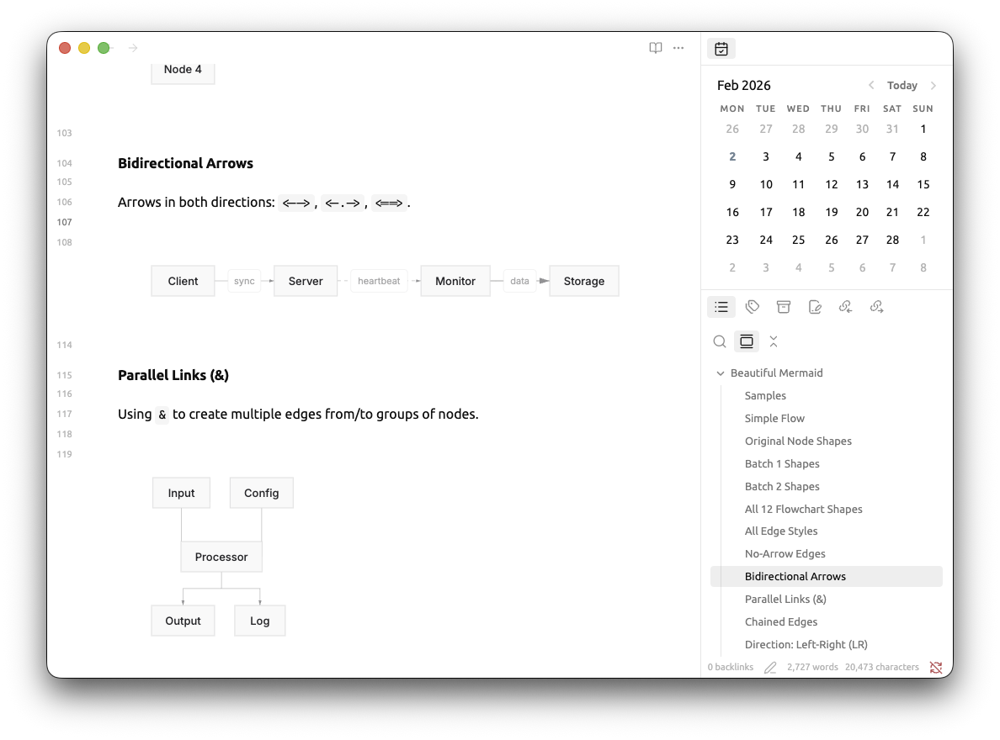

<div align="center">

# Obsidian Beautiful Mermaid

**Render Mermaid diagrams as beautiful SVGs for Obsidian**

Ultra-fast, fully themeable, zero DOM dependencies. Built for the AI era.




</div>

## How to install

1. Download obsidian-beautiful-mermaid.zip file
2. Create a folder called obsidian-beautiful-mermaid in your vault's plugins folder: `/path/to/vault/.obsidian/plugins/obsidian-beautiful-mermaid/`
3. Enable the plugin in Obsidian:
   - Settings → Community plugins → Enable "Claudian"


## How to use

```beautiful-mermaid
graph TD
  A[Start] --> B[Process] --> C[End]
```

> [!CAUTION]
>
> Use `beautiful-mermaid` instead of `mermaid`
